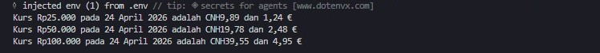

# Tugas Mandiri 08: Runtime Congfiguration dan Internationaliztion

**Nama:** Fatikhah Sukma Arti
**NIM:** 103122400019
**Kelas:** SE-08-01  

## Tugas
Waktunya menukar uang!

Pada tugas ini kamu akan membuat program yang menampilkan kurs rupiah (IDR) terhadap renminbi luar Tiongkok (CNH) dan euro (EUR). Gunakan [link API ini](./https://cdn.jsdelivr.net/npm/@fawazahmed0/currency-api@latest/v1/currencies/idr.json) untuk mengambil data.

Tantangan

1. Simpanlah URL API ke dalam `.env` sebagai `BASE_API`
2. Gunakan `Intl` untuk memformat nilai mata uang dan waktu kamu mengambil data kurs.
3. Hapus pesan promosi `dotenv`

Ujilah dengan Rp25000, Rp50000, dan Rp100000.

## Kode Sumber
Tersedia di [index.js](./index.js)

## Output

## Deskripsi Program
Program ini tugasnya ngambil data kurs terbaru dari API, terus dipakai buat ngitung berapa nilai Rupiah kalau dikonversi ke CNH dan Euro. Pertama, program membaca URL API dari file .env pakai dotenv, jadi alamat API nggak perlu ditulis langsung di kode.

Setelah itu ada fungsi ambilData(angka) yang bakal melakukan fetch ke API. Kalau berhasil, data respons diubah ke format JSON lalu diambil informasi kurs dan tanggalnya. Tanggal tersebut juga diformat ke format Indonesia menggunakan Intl.DateTimeFormat supaya tampil lebih familiar.

Nilai Rupiah yang dimasukkan kemudian diformat menjadi tampilan mata uang Rupiah (Rp). Program selanjutnya menghitung hasil konversi ke CNH dan EUR berdasarkan kurs yang didapat dari API. Hasil konversi dibulatkan menjadi dua angka desimal agar lebih rapi saat ditampilkan.

Terakhir, semua hasil konversi dicetak ke terminal menggunakan console.log. Di bagian bawah program sudah disediakan beberapa contoh nominal yang langsung dijalankan satu per satu, sehingga pengguna bisa langsung melihat beberapa hasil konversi tanpa harus memasukkan data secara manual setiap kali program dijalankan.